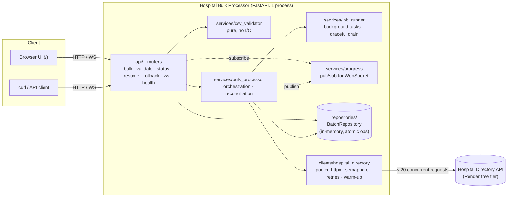
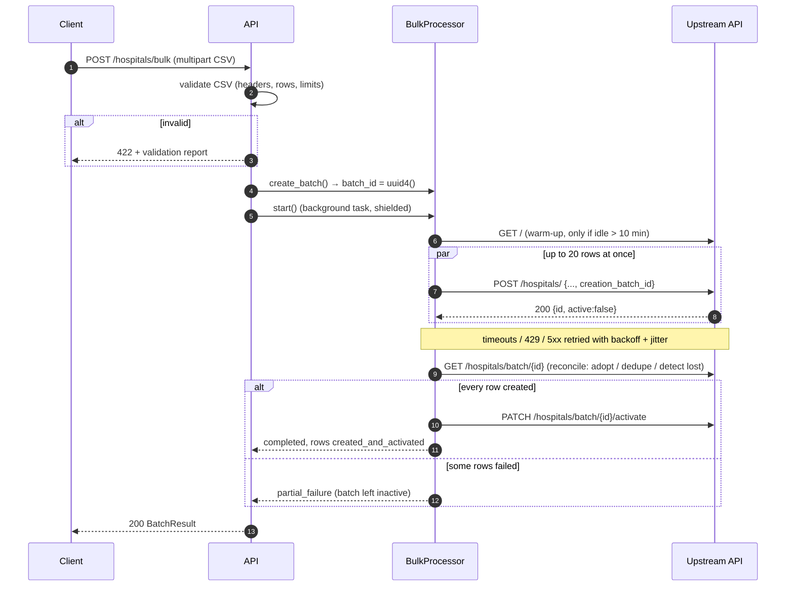
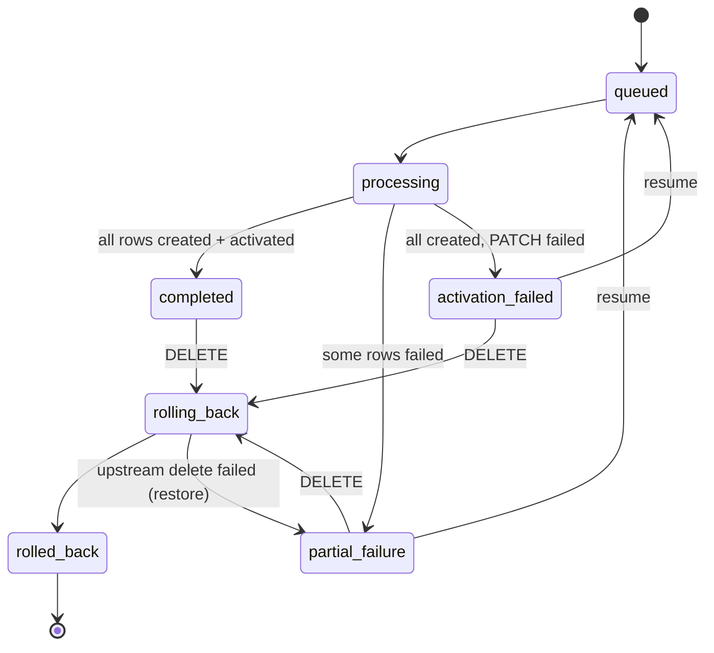

# Hospital Bulk Processor

A FastAPI service that bulk-imports hospitals from a CSV into the
[Hospital Directory API](https://hospital-directory.onrender.com/docs). It validates the file,
creates every row upstream **concurrently** under one batch id, and **activates the batch only
when every row exists**. Progress is live over WebSocket or polling. Failed batches can be
**resumed** (without duplicates) or **rolled back**.

- **Live:** <https://hospital-bulk-processor-jvl7.onrender.com> (UI at `/`, OpenAPI docs at [`/docs`](https://hospital-bulk-processor-jvl7.onrender.com/docs)).
  Free tier: the first request after ~15 min idle takes ~30-60 s while the service wakes.
- **Repository:** <https://github.com/Parthesh10/paribus-hospital-bulk-processor>
- **Design rationale:** [DECISIONS.md](DECISIONS.md), including the upstream API findings that shaped it.

| | |
|---|---|
| 20-row CSV, sequential | **106.5 s** |
| 20-row CSV, this service (concurrency 20) | **6.8 s** (15.8x faster) |
| Tests | 145 (unit + API + WebSocket), 99% line coverage; plus an opt-in real-upstream test |
| Static checks | `ruff` (lint + format), `mypy --strict` |

---

## Contents

1. [Architecture](#architecture)
2. [Request flow](#request-flow)
3. [Statuses and failure policy](#statuses-and-failure-policy)
4. [API reference](#api-reference)
5. [Performance](#performance)
6. [Running locally](#running-locally)
7. [Testing](#testing)
8. [Configuration](#configuration)
9. [Project layout](#project-layout)
10. [With more time / at scale](#with-more-time--at-scale)

---

## Architecture



Layering rules: routers only translate HTTP ⇄ services; **all** upstream I/O goes through
`HospitalDirectoryClient`; the processor never touches HTTP request objects; storage sits behind
the `BatchRepository` interface, so swapping in Redis/Postgres means writing one class.

## Request flow

`POST /hospitals/bulk` (synchronous mode, the default):



With `?async=true` the API answers `202` right after step 4 with `links.status` and
`links.websocket`; the same run continues in the background.

## Statuses and failure policy

**Row status** (`hospitals[].status`):

| Status | Meaning |
|---|---|
| `pending` | Queued, not yet attempted in this run |
| `in_progress` | Create request in flight |
| `created` | Exists upstream but **inactive**: the batch was not (yet) activated because other rows failed or activation failed |
| `created_and_activated` | Exists upstream and the batch is active |
| `failed` | Create failed after retries; `error` explains why. Retried by `resume` |
| `skipped_invalid` | Failed CSV validation; never sent (only with `?skip_invalid=true`) |
| `rolled_back` | Was created, then deleted by `DELETE /hospitals/bulk/{id}` |

**Batch status** (`status`):



**Failure policy.** A batch is **never activated partially**. If any row fails, the batch stays
inactive, so its hospitals are invisible to consumers of the directory. The caller then decides:

- **Resume:** `POST /hospitals/bulk/{id}/resume` retries only the failed rows under the *same*
  batch id, then activates. It first reconciles against upstream, so rows whose earlier create
  actually landed are adopted, not duplicated. It's idempotent: a `completed` batch is a no-op,
  and concurrent resumes get `409`.
- **Roll back:** `DELETE /hospitals/bulk/{id}` deletes the batch upstream.

Nothing is rolled back automatically: a transient upstream outage should not throw away
19 good rows. See [DECISIONS.md](DECISIONS.md#d8-failure-policy-never-activate-partially-resume-or-explicit-rollback).

## API reference

Interactive docs with schemas and examples: **`/docs`** (Swagger) and **`/redoc`**. Every error has
the same body: `{"error": {"code": "...", "message": "...", "details": ...}}`.

| Method | Path | Purpose |
|---|---|---|
| `POST` | `/hospitals/bulk` | Bulk create from CSV (`?async=true`, `?skip_invalid=true`) |
| `POST` | `/hospitals/bulk/validate` | Validate a CSV without calling upstream |
| `GET` | `/hospitals/bulk/{batch_id}/status` | Live batch status + per-row state (polling) |
| `WS` | `/ws/bulk/{batch_id}` | Progress event stream |
| `POST` | `/hospitals/bulk/{batch_id}/resume` | Retry failed rows / activation (`?async=true`) |
| `DELETE` | `/hospitals/bulk/{batch_id}` | Roll back: delete the batch upstream |
| `GET` | `/health` | Liveness (`?deep=true` also pings upstream) |
| `GET` | `/` | Web UI |

Examples use `BASE=http://localhost:8000` and the files in [`samples/`](samples).

### `POST /hospitals/bulk`: bulk create

```bash
curl -F "file=@samples/hospitals_valid_20.csv" $BASE/hospitals/bulk
```

```jsonc
{
  "batch_id": "05e73012-a751-4daf-bf70-4d300fd8d8bc",
  "total_hospitals": 20,
  "processed_hospitals": 20,
  "failed_hospitals": 0,
  "processing_time_seconds": 6.449,
  "batch_activated": true,
  "hospitals": [
    {"row": 1, "hospital_id": 38, "name": "General Hospital", "status": "created_and_activated", "error": null, "attempts": 1}
    // ... 19 more
  ],
  // additive fields (the spec's fields above are unchanged):
  "status": "completed",
  "skipped_hospitals": 0,
  "pending_hospitals": 0,
  "resumable": false,
  "activation_error": null,
  "runs": 1,
  "created_at": "2026-09-27T10:06:26.099Z",
  "updated_at": "2026-09-27T10:06:32.548Z",
  "links": {
    "status": "/hospitals/bulk/05e73012-.../status",
    "websocket": "/ws/bulk/05e73012-...",
    "resume": "/hospitals/bulk/05e73012-.../resume",
    "rollback": "/hospitals/bulk/05e73012-..."
  }
}
```

Background mode returns immediately:

```bash
curl -F "file=@samples/hospitals_valid_20.csv" "$BASE/hospitals/bulk?async=true"
# 202 {"batch_id": "...", "status": "queued", "total_hospitals": 20, "links": {...}}
```

Invalid rows reject the whole file by default (`422`, `details` = the validation report). To
process the valid rows and report the others as `skipped_invalid`:

```bash
curl -F "file=@samples/hospitals_invalid.csv" "$BASE/hospitals/bulk?skip_invalid=true"
```

Responses: `200` result · `202` accepted (async) · `413` file too large · `422` invalid CSV.
A batch with failed rows is still `200` with `"status": "partial_failure"`: the request
succeeded, and the result describes the rows.

### `POST /hospitals/bulk/validate`: validate only

```bash
curl -F "file=@samples/hospitals_invalid.csv" $BASE/hospitals/bulk/validate
```

```jsonc
{
  "valid": false, "total_rows": 7, "valid_rows": 2, "invalid_rows": 5,
  "errors": [
    {"code": "missing_required_field", "message": "'name' is required.", "row": 2, "line": 3, "column": "name"},
    {"code": "invalid_phone", "message": "'call-me-maybe' is not a valid phone number.", "row": 4, "line": 5, "column": "phone"}
    // ...
  ],
  "warnings": [
    {"code": "duplicate_row", "message": "Row 6 duplicates row 1; both will be created if processed.", "row": 6, "line": 8, "column": null},
    {"code": "blank_lines_ignored", "message": "Ignored 1 blank line(s): 6", "row": null, "line": null, "column": null}
  ],
  "rows": [{"row": 1, "line": 2, "name": "Good Hospital", "address": "1 Main St", "phone": "555-0100", "valid": true} /* ... */]
}
```

Checks: extension / content type, size limit, empty file, UTF-8 (BOM stripped), binary content,
header case/whitespace, missing/unknown/duplicate columns (with a hint for `;`-separated files),
max 20 rows, blank lines, required `name`/`address`, length limits, phone format, extra values in
unnamed columns, and duplicate rows (warning).

### `GET /hospitals/bulk/{batch_id}/status`: poll progress

```bash
curl $BASE/hospitals/bulk/$BATCH_ID/status
```

Same body as the bulk result, with live counts (`pending_hospitals` drops as rows finish) and
`processing_time_seconds` ticking while `status` is `processing`.

### `WS /ws/bulk/{batch_id}`: stream progress

```bash
websocat ws://localhost:8000/ws/bulk/$BATCH_ID
# or: python -m websockets ws://localhost:8000/ws/bulk/$BATCH_ID
```

```jsonc
{"type": "snapshot", "status": "processing", "result": { /* full BatchResult */ }}
{"type": "row", "row": {"row": 3, "hospital_id": null, "status": "in_progress", ...}, "counts": {...}}
{"type": "row", "row": {"row": 3, "hospital_id": 117, "status": "created", ...}, "counts": {...}}
{"type": "job", "status": "completed", "counts": {...}, "result": { /* final BatchResult */ }}
// server closes the socket after a terminal "job" event
```

### `POST /hospitals/bulk/{batch_id}/resume`: retry failures

```bash
curl -X POST $BASE/hospitals/bulk/$BATCH_ID/resume          # waits, returns BatchResult
curl -X POST "$BASE/hospitals/bulk/$BATCH_ID/resume?async=true"   # 202
```

`200` result (or no-op for a `completed` batch) · `202` async · `404` unknown · `409` running or rolled back.

### `DELETE /hospitals/bulk/{batch_id}`: roll back

```bash
curl -X DELETE $BASE/hospitals/bulk/$BATCH_ID
```

Deletes every hospital of the batch upstream; rows become `rolled_back`. Idempotent.
`409` while processing · `502` if upstream delete fails (the batch keeps its previous status).

### `GET /health`

```bash
curl $BASE/health             # never calls upstream: safe for platform health checks
curl "$BASE/health?deep=true" # also pings upstream
```

## Performance

Measured with [`scripts/benchmark.py`](scripts/benchmark.py): the production code path
(validator → processor → client), real upstream, 20-row CSV, upstream warmed first. Every batch
was rolled back afterwards.

| Concurrency | Wall time (s) | Speed-up vs sequential | Rows/s |
|---:|---:|---:|---:|
| 1 (sequential) | 106.45 | 1.0x | 0.19 |
| 5 | 22.71 | 4.7x | 0.88 |
| 10 | 11.53 | 9.2x | 1.73 |
| **20 (default)** | **6.76** | **15.8x** | **2.96** |

Upstream `POST /hospitals/` takes ~5.3 s per call (reads take ~0.3 s), so the job is purely
latency-bound. Wall time ≈ `ceil(rows / concurrency) × 5.3 s` + one reconciliation GET + one
activation PATCH (~0.6 s). What makes that possible:

- **Bounded fan-out**: `asyncio.gather` over rows, capped by a process-wide semaphore shared
  by *all* batches, so ten simultaneous uploads still send at most 20 requests upstream.
- **One pooled `httpx.AsyncClient`** for the process lifetime: keep-alive, no per-row TLS
  handshake.
- **The semaphore is held per attempt, not across backoff sleeps**, so a retrying row doesn't
  block the others.
- **Cold starts are absorbed once**: a coalesced warm-up ping with a 90 s timeout, instead of
  20 requests timing out together.

Reproduce: `python -m scripts.benchmark --concurrency 1 5 10 20`.

## Running locally

Requires Python 3.12+.

```bash
python -m venv .venv
source .venv/bin/activate            # Windows: .venv\Scripts\activate
pip install -r requirements-dev.txt
uvicorn app.main:app --reload        # http://localhost:8000  (UI at /, docs at /docs)
```

Docker:

```bash
docker compose up --build            # http://localhost:8000
```

## Testing

```bash
pytest                               # 145 unit/API/WebSocket tests, upstream mocked
pytest --cov                         # coverage report (99%)
pytest -m integration                # real upstream; creates and deletes its own batch
ruff check . && ruff format --check . && mypy
python -m scripts.smoke_test http://localhost:8000   # end-to-end against a running instance
```

The API tests run against [`tests/fake_upstream.py`](tests/fake_upstream.py), a stateful
emulation of the real API (same status codes and quirks) with fault injection: HTTP errors,
timeouts, and "commit then lose the response". The client's retry logic is tested with `respx`.
Covered scenarios: full success, partial failure (no activation), timeouts and 5xx with retry,
non-retryable 422, activation failure, activation applied but its response lost, duplicate
cleanup, adoption of landed-but-failed rows, upstream data loss, resume, concurrent resume,
rollback (success/failure/idempotency), cancellation on shutdown, validation, polling, WebSocket
streaming, and oversize uploads.

CI ([`.github/workflows/ci.yml`](.github/workflows/ci.yml)) runs lint, types, tests with a coverage
gate, and a Docker build with a `/health` probe.

## Configuration

Environment variables (or `.env`; see [`.env.example`](.env.example)):

| Variable | Default | Purpose |
|---|---|---|
| `UPSTREAM_BASE_URL` | `https://hospital-directory.onrender.com` | Hospital Directory API |
| `UPSTREAM_MAX_CONCURRENCY` | `20` | Process-wide cap on in-flight upstream requests |
| `UPSTREAM_CONNECT_TIMEOUT` | `10` | Seconds |
| `UPSTREAM_READ_TIMEOUT` | `30` | Seconds per request (creates take ~5.3 s) |
| `UPSTREAM_COLD_START_TIMEOUT` | `90` | Warm-up ping timeout (cold starts: 25-60 s) |
| `UPSTREAM_WARM_TTL_SECONDS` | `600` | Skip warm-up if upstream answered this recently |
| `UPSTREAM_WARM_ON_STARTUP` | `true` | Warm upstream in the background at boot |
| `UPSTREAM_MAX_ATTEMPTS` | `4` | Attempts per request (1 = no retries) |
| `UPSTREAM_BACKOFF_BASE` / `_MAX` | `0.5` / `8` | Exponential backoff (full jitter), seconds |
| `MAX_CSV_ROWS` | `20` | Rows per CSV |
| `MAX_UPLOAD_BYTES` | `262144` | Upload limit (256 KiB) |
| `MAX_STORED_BATCHES` | `1000` | In-memory retention; oldest finished batches evicted |
| `LOG_LEVEL` / `LOG_FORMAT` | `INFO` / `json` | `json` or `text` |
| `SHUTDOWN_GRACE_SECONDS` | `20` | Time running batches get to finish on shutdown |
| `PORT` | `8000` | Container listen port (Render injects its own) |

## Project layout

```
app/
  main.py               app factory, lifespan (shared httpx client, drain on shutdown)
  config.py             pydantic-settings
  api/                  routers: bulk.py, ws.py, health.py; deps.py (service container)
  services/             bulk_processor.py, csv_validator.py, progress.py, job_runner.py
  clients/              hospital_directory.py (all upstream I/O), retry.py
  repositories/         BatchRepository interface + InMemoryBatchRepository
  models/               domain.py (state machine), schemas.py (API), upstream.py (wire)
  middleware.py         request ids, body-size limit
  errors.py             exception → JSON error mapping
  static/index.html     the UI
tests/                  unit/, api/, integration/, fake_upstream.py
scripts/                benchmark.py, smoke_test.py
samples/                valid 20 rows, missing phone, invalid, 21 rows
```

## With more time / at scale

- **Durable state + horizontal scale.** Batch state lives in one process, so the service runs a
  single worker and a restart forgets batches (upstream keeps the hospitals). Next step: a
  `RedisBatchRepository` or `PostgresBatchRepository` (the interface is already atomic:
  compare-and-set transitions, per-row updates) and Redis pub/sub behind `ProgressBroker`. Then
  any instance can serve status/WS for any batch.
- **Queue workers.** Replace `JobRunner.submit` with an enqueue (arq/RQ/SQS). API pods stay
  thin, workers own upstream concurrency, and a crash mid-batch is picked up by another worker.
  Reconciliation already makes re-running a batch safe.
- **Idempotency keys.** An `Idempotency-Key` header on `POST /hospitals/bulk`, so client retries
  don't create a second batch. Upstream idempotency keys would let us drop content-based
  reconciliation entirely.
- **Rate limiting and quotas** per client (token bucket at the edge or in Redis), plus an
  adaptive upstream limiter (AIMD on 429/latency) instead of a fixed semaphore.
- **Auth** (API keys/OAuth) and per-tenant batch visibility.
- **Observability:** OpenTelemetry traces (one span per upstream call, linked to the batch),
  Prometheus metrics (rows/s, retry counts, upstream latency histograms, batch outcomes), and
  alerts on activation failures.
- **Larger files:** stream-parse CSVs and process in pages if the 20-row cap were lifted.
  Upstream latency, not our CPU, is the bottleneck.
